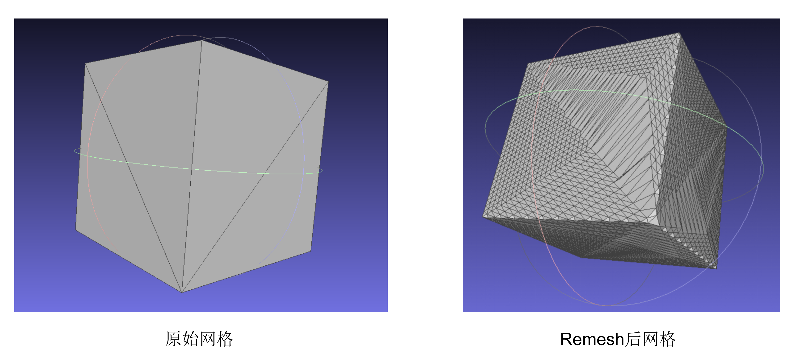

# MAPS

复现自文章
[MAPS: multiresolution adaptive parameterization of surfaces](http://dpd.cs.princeton.edu/Papers/sig98.pdf)

## build

**1.下载xmake**

项目默认采用[xmake](https://xmake.io/)构建,
这里有详细的[安装方法](https://xmake.io/#/guide/installation)

**2. 编译**

``` shell
xmake build
```

> 编译过程会询问并自动下载依赖

**3. 运行实例代码**

1. 实例1

```
xmake run MapsExample1
```

运行结果



2. 实例2

```
xmake run MapsExample2
```

运行结果


## debug

在调试代码之前，需要先用命令`xmake f --mode=debug` 将项目编译成debug版本,
之后根据对应的IDE生成相应的配置文档

**1. visual studio**

使用如下命令生成vs的配置文件

```shell
xmake project -k vsxmake
```

之后用vs打开vsxmake下的sln文件即可

**2. cmake**

对于使用cmake作为项目配置文件的IDE, 如CLion, 可以用如下命令在项目根目录生成CMakeList.txt

```shell
xmake project -k cmakelist
```

**3. compile_commands.json**

`compile_commands.json`可以作为绝大多是IDE(如CLion)或编辑器LSP
(如clangd, ccls, vscode-cpptools)的配置文件, 可以提供基本的代码补全功能, 但不能编译和调试。

使用如下命令生成`compile_commands.json`

```shell
xmake project -k compile_commands
```

**4. 其他**

其他工程配置文件如xcode, ninja,
请在[官方文档](https://xmake.io/#/plugin/builtin_plugins?id=generate-ide-project-files)中查阅

